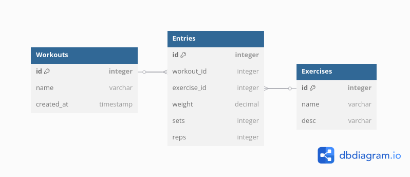

# **Fitness Tracker Backend**
## Setup
Runs just the db which is required for compiling (else flyway cries)
``` shell
    docker compose up db --build
```
Compiles our code into .jar file in ```./target```
``` shell
    mvn clean install
```
Runs our Docker container with the db and app images (created using existing ```.jar```)
``` shelldocker 
    docker compose up --build --force-recreate --remove-orphans
```
While Docker DB is running, you can access it via shell
``` shell
    docker exec -it postgresql psql -U postgres
```

## Test
To run the tests, make sure you run the db in docker first
``` shell
    docker compose up db --build
```
then run
``` shell
    mvn test
```

Kotlin Tests: https://www.baeldung.com/kotlin/spring-boot-testing

## Database Design


## Endpoints for MVP
FindById will error if not found, FindBy anything else will return empty list

## Resources
Test Containers: https://jskim1991.medium.com/spring-boot-configure-testcontainers-in-your-test-code-this-way-417b221e55b
LocalDate REST Params: https://www.baeldung.com/spring-date-parameters
