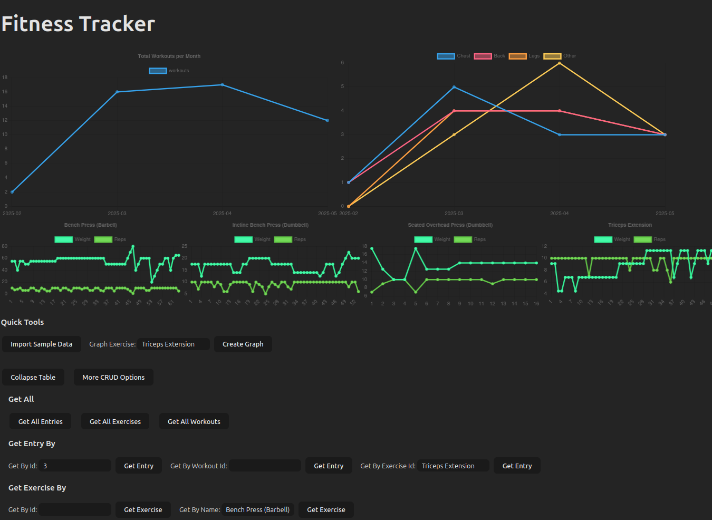

# **Fitness Tracker Backend**



## Motivation
The idea of this project was to make a basic CRUD Application from scratch that connects Frontend/Backend using some of the tools I wanted to learn more about:
- Frontend
    - Typescript
    - Vite
    - HTML
    - CSS
    - Chartjs

- Backend
    - Kotlin
    - Springboot
    - Flyway
    - PostgreSQL
    - Docker
    - Shell Scripts

I chose a Fitness Tracker because my current app charges money to Graph my lifts and I thought it would be fun to try do that myself. 

The CSV converter part to load sample data is not designed generically and is specifically for my exported data. Assumptions such as 1 workout per day max and workout split names containing chest/push, back/pull, legs/lower are all hardcoded based on my data.

## Start Up
Run the start.sh file in ./scripts
``` shell
./scripts/start.sh 
```

## Test
Run the tests
``` shell
mvn test
```

## Database Design


## Endpoints Available
- [x] CREATE
    - [x] Post Workout
    - [x] Post Entry
    - [x] Post Exercise
- [x] READ
    - [x] Workouts
        - [x] Get All
        - [x] Get By Id
        - [x] Get By Name
        - [x] Get By Date
    - [x] Entry
        - [x] Get All
        - [x] Get By Id
        - [x] Get By WorkoutId
        - [x] Get By ExerciseId
    - [x] Exercise
        - [x] Get All
        - [x] Get By Id
        - [x] Get By Name
- [x] UPDATE
    - [x] Put Entry
    - [x] Put Workout
    - [x] Put
- [x] DELETE
    - [x] Delete Entry
    - [x] Delete Workout
    - [x] Delete Exercise
- [x] Import my CSV
